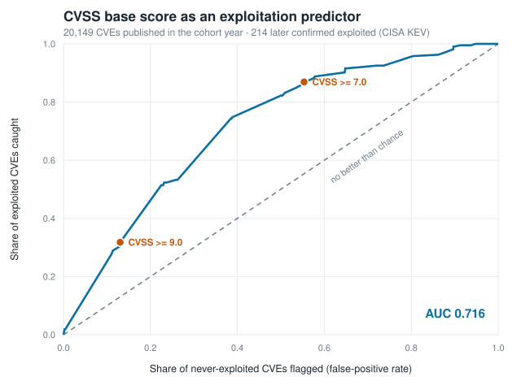

# Does a high CVSS score actually predict that a CVE gets exploited?

Joins every CVE published in 2021 to the CISA catalog of vulnerabilities confirmed
exploited in the wild, and measures how well the 0–10 severity score separates the two.

Almost every patching queue in existence is sorted by CVSS, usually with a rule like
"everything 7.0 and above, this sprint". That rule has a cost and a yield, and both are
measurable against ground truth rather than argued about. This measures them.

> **Status:** PASSED — 37 tests, full report, 4 s in a clean virtualenv.
> **Deck:** [slides](https://mlodian.github.io/agent-factory/projects/2026-09-11-cvss-vs-exploitation/deck/dist/deck.html) · [PDF](https://github.com/mlodian/agent-factory/releases/download/deck-2026-09-11-cvss-vs-exploitation/deck.pdf) · [PPTX](https://github.com/mlodian/agent-factory/releases/download/deck-2026-09-11-cvss-vs-exploitation/deck.pptx) · **Demo script:** [DEMO.md](DEMO.md)

## Quickstart

```bash
pip install -q -r requirements.txt
pytest -q tests/
python3 -m src.main --report
```

The data is committed, so that runs offline in about four seconds. To pull both feeds
again from source (roughly 14 minutes, mostly NVD rate-limiting):

```bash
python3 data/fetch_data.py --refresh
```

## What it found

**CVSS ranks better than a coin flip, and still makes a bad queue.**

Of the **20,149** CVEs NVD published in 2021, **214** have since been confirmed exploited
— a base rate of **1.06%**.

The score is genuinely not noise. Exploitation rises monotonically with severity:

| Band | CVEs | Exploited | Rate | vs base rate |
|---|---:|---:|---:|---:|
| LOW | 441 | 0 | 0.00% | 0.00x |
| MEDIUM | 8,488 | 28 | 0.33% | 0.31x |
| HIGH | 8,554 | 118 | 1.38% | 1.30x |
| CRITICAL | 2,666 | 68 | 2.55% | 2.40x |

CRITICAL CVEs reach the catalog at 7.7x the rate of MEDIUM ones, not one of the 441 LOW
CVEs has ever been reported exploited, and the score's overall ranking power is
**AUC 0.716** — pick one exploited and one never-exploited CVE at random and the exploited
one scores higher 71.6% of the time.

What defeats it is the base rate, not the ranking:

| Policy | Queue | Workload | Catches | Misses | Precision | Recall |
|---|---:|---:|---:|---:|---:|---:|
| patch >= 4.0 | 19,708 | 97.8% | 214 | 0 | 1.09% | 100.0% |
| patch >= 7.0 | 11,220 | 55.7% | 186 | 28 | 1.66% | 86.9% |
| patch >= 9.0 | 2,666 | 13.2% | 68 | 146 | 2.55% | 31.8% |

The industry-standard "everything 7.0 and above" queues **55.7% of the entire year** —
11,220 CVEs — to reach 186 of the 214 that mattered. **98.34% of that queue was never
exploited by anyone**, and 28 exploited CVEs still sit below the cutoff where nobody is
looking. Tightening to 9.0 cuts the queue to 13.2% but catches only 31.8% of the
exploited ones.



One more thing worth noticing: no individual CVSS component carries the signal. Attack
Vector, Privileges Required and User Interaction all land within 0.039 of AUC 0.500 on
their own — and locally-exploitable CVEs reach the catalog slightly *more* often (1.22%)
than network-reachable ones (1.06%), the opposite of the ordering the scoring model
assumes.

Every number above appears in [VERIFY.md](VERIFY.md).

## Data

| | |
|---|---|
| Source | [CISA KEV](https://www.cisa.gov/sites/default/files/feeds/known_exploited_vulnerabilities.json) (labels) + [NVD CVE API 2.0](https://services.nvd.nist.gov/rest/json/cves/2.0) (scores) |
| Licence | US public domain (both) |
| Records | 1,705 KEV entries; 20,149 CVEs published in 2021 |
| Retrieved | 2026-09-11, KEV catalog version 2026.09.10 |
| Re-fetch | `python3 data/fetch_data.py` |

Not endorsed by NIST or CISA; the interpretation is this project's own. Full provenance,
including SHA256 checksums and all 43 NVD request URLs, is in
[data/SOURCE.md](data/SOURCE.md).

## How it works

`data/fetch_data.py` pulls the KEV feed verbatim and pages the whole 2021 CVE cohort out
of NVD, keeping eight fields per CVE and discarding the ~90 MB of CPE match data the
analysis never reads. `src/population.py` joins the two on CVE id, producing one list of
scored, labelled vulnerabilities. `src/metrics.py` does the arithmetic — band rates, the
threshold contingency tables, and a rank-based AUC that handles ties correctly, which
matters because CVSS is coarse and thousands of CVEs share a score. No dependency does
any of this; it is all standard library. See [ARCHITECTURE.md](ARCHITECTURE.md).

## Limitations

- **KEV is not a census of exploitation, and this is the big one.** It is CISA's curated
  list of vulnerabilities with *confirmed, reported* exploitation that matter to US
  federal networks. Real exploitation that was never observed, never reported, or never
  federally relevant is labelled "not exploited" here. The 1.06% base rate is therefore a
  floor, and every precision figure in this README is a floor too.
- **The label may not be independent of the score.** CISA analysts can see the CVSS score
  when deciding what to add, and vendors publicise high-scoring bugs more loudly. Some
  part of the measured AUC 0.716 could be that feedback loop rather than attacker
  behaviour. This project cannot separate the two.
- **One cohort, one year.** Everything here describes CVEs published in 2021. 2021 was
  chosen for its ~4.7 years of exposure, but it is also the single largest KEV year
  (215 entries), so it may flatter the base rate relative to a quieter cohort.
- **Right-censored.** A 2021 CVE first exploited in 2027 counts as "never exploited"
  today. The direction of that error is known — it can only understate exploitation —
  but its size is not.
- **The cohort is not "CVEs with a 2021 id".** It is CVEs NVD *published* in 2021, and the
  two differ at the boundary: 204 of the 214 exploited CVEs here carry a CVE-2021-* id, 10
  carry an older id that NVD published during 2021, and a further 11 KEV entries with
  CVE-2021-* ids were published outside 2021 and are excluded. Publication date is the
  defensible cut — it is when defenders could first have seen the score — but a reader
  comparing against "215 KEV entries from 2021" will not get the same number.
- **Severity bands are the score, rounded.** The band table and the threshold table are
  two views of one variable, not independent evidence.
- **No EPSS comparison.** The obvious follow-up — does FIRST's exploit-prediction score
  beat CVSS at this same task — is deliberately out of scope; it is the
  `epss-vs-cvss-triage` backlog idea.

---

*Built by [agent-factory](../../README.md) on 2026-09-11. Reviewed by a human before merge.*
