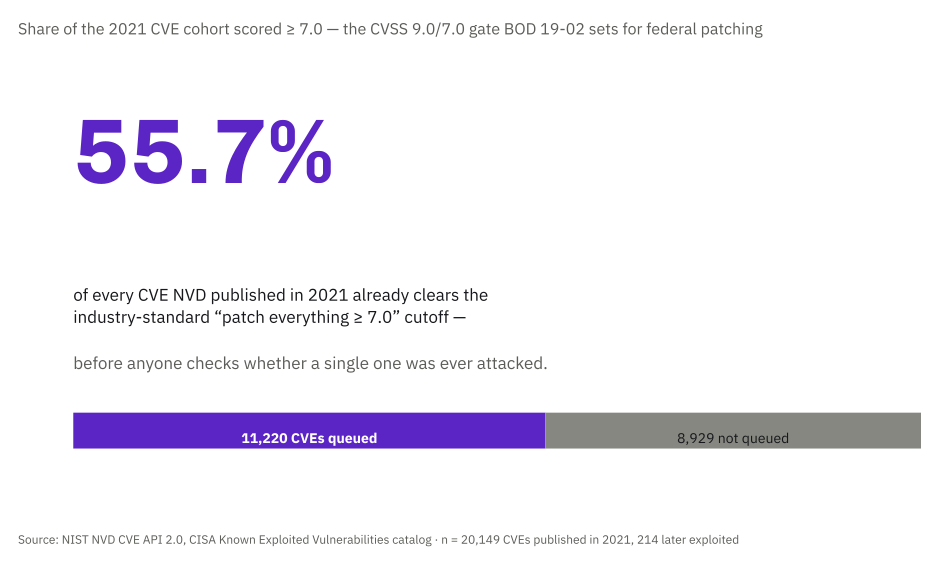
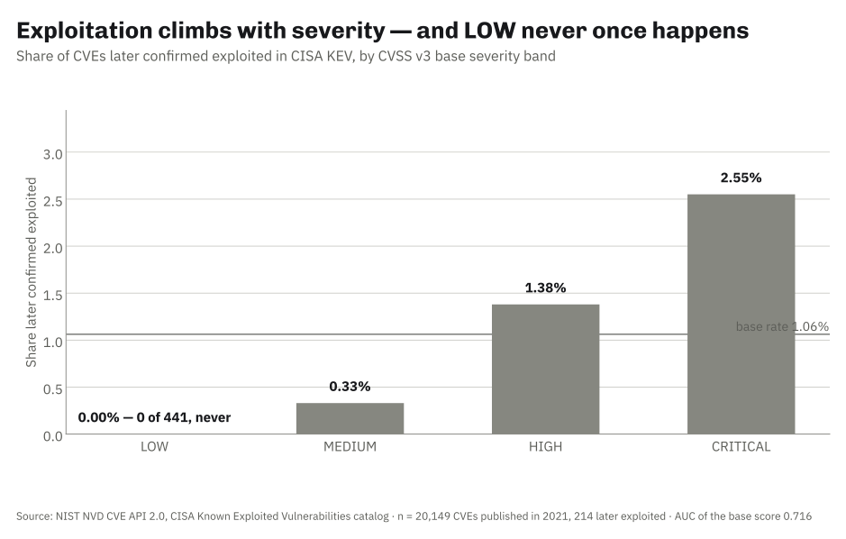
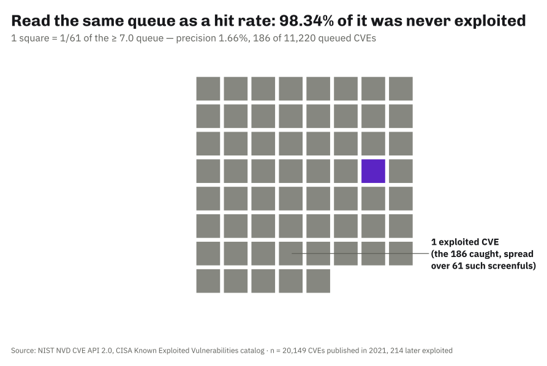
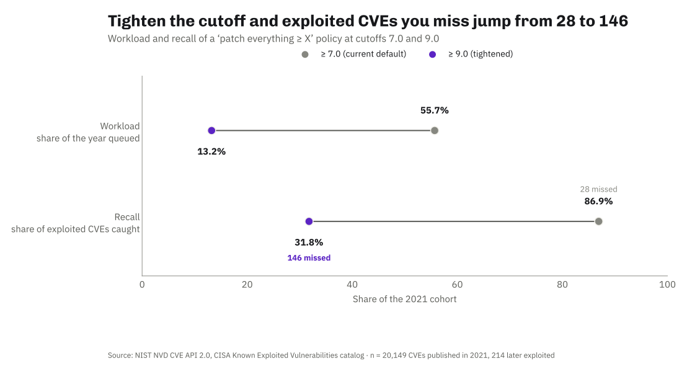
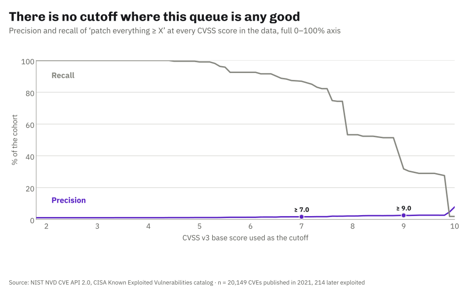
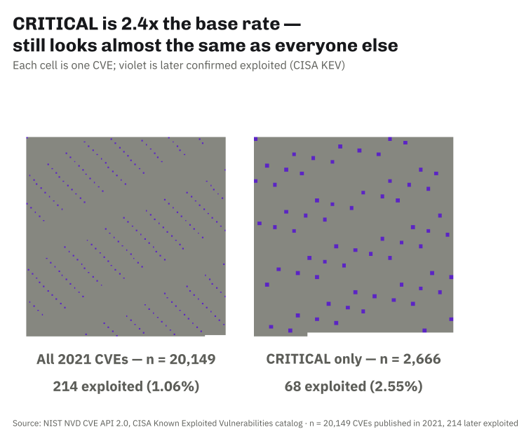
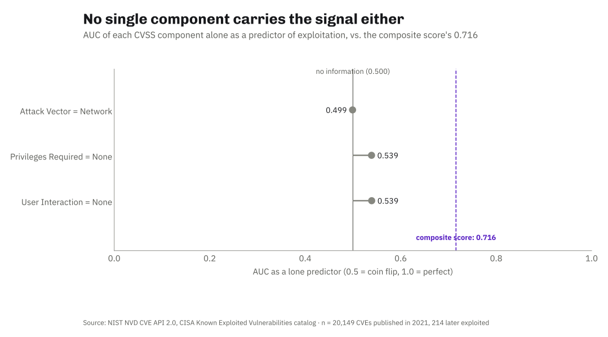

<!-- _class: title -->
<!-- _paginate: false -->

# Does a high CVSS score actually predict that a CVE gets exploited?

Your patch queue is sorted by severity. Here is what that buys you.

2026-09-11 · github.com/mlodian/agent-factory

<!--
Open with the question, not the tech.

I picked this because I have sorted a patch queue by CVSS and never once checked
whether the sort worked. The data to check it is public and has been the whole time.
-->

---

## The problem

Every vulnerability gets a 0–10 severity score. Almost every patching policy is a
threshold on it — "everything 7.0 and above, this sprint".

Nobody checks what fraction of that queue was ever actually attacked.

<!--
Concrete: this is the rule in CIS controls, in PCI-DSS, in most internal SLAs, and in
the default view of every scanner you have used.

The rule is testable and almost never tested. That is the gap.
-->

---

## Why it matters

- **Security teams** burn their whole patching budget on the threshold
- **The queue is enormous** — over half of a year's CVEs clear 7.0
- **The ground truth exists** — CISA publishes what was really exploited

<!--
Third bullet is the one that makes this a project rather than an opinion.

CISA's Known Exploited Vulnerabilities catalog is a public list of CVEs with confirmed
in-the-wild exploitation. Join it to NVD's scores and the question answers itself.
-->

---

## Architecture



<!--
Left to right: two public feeds, one fetch script that projects and checksums, two
committed extracts, a join on CVE id, then pure arithmetic.

No database, no notebook, no dependency except pytest. The whole analysis is standard
library, because every operation is a count, a ratio, or a sort.
-->

---

## How it works

**Verification never touches the network.**

The extracts are committed and checksummed. `verify.sh` re-checks the hashes, then
analyses the pinned snapshot — offline, in seconds.

<!--
The one genuinely interesting decision.

The obvious design re-fetches during verification. That would take ~14 minutes, break
whenever NVD rate-limits, and produce different numbers every run — so no number in the
README could ever be checked against it.

Pinning the snapshot means every figure on the next slide is reproducible by anyone who
clones the repo. Cost, stated in ARCHITECTURE.md: the snapshot goes stale, and a refresh
prints a DRIFT line rather than pretending the feeds stood still.
-->

---

<!-- _class: demo -->

## Demo

```bash
bash verify.sh
```

<!--
Switch to the terminal. Follow DEMO.md timings — this is the 1:45–3:15 block.

Narrate: checksums, then 38 tests, then the join, then the tables.

Point at: how fast it is. No network, no waiting.
-->

---

## Results

| Measure | Value |
|---|---|
| CVEs published in 2021 | 20,149 |
| Later confirmed exploited | 214 |
| Base rate | 1.06% |
| Ranking power of CVSS (AUC) | 0.716 |
| Queue at "patch >= 7.0" | 11,220 CVEs — 55.7% of the year |
| Exploited CVEs it catches | 186 |
| Share of that queue never exploited | 98.34% |
| Exploited CVEs it still misses | 28 |

<!--
Every number here appears in VERIFY.md.

What it means: CVSS is NOT noise. AUC 0.716 is real signal, and zero of the 441 LOW
CVEs were ever exploited.

What it does NOT mean: that the score is useless. The failure is the base rate. At
1.06%, there are 93 unexploited CVEs for every exploited one, so even a good ranking
puts thousands of them above your cutoff.

Say it this way: ninety-eight percent of that work bought nothing. Then pause.
-->

---

## Limitations

- **KEV is confirmed *reported* exploitation** — not a census. Every precision figure here is a floor.
- **The label may not be independent of the score** — CISA analysts can see CVSS
- **One cohort, one year** — 2021, chosen for ~4.7 years of exposure
- **Right-censored** — a 2021 CVE first exploited in 2027 counts as "never" today

<!--
Own this slide. It is the one that makes the audience trust the rest.

The first bullet is the real one. If someone pushes: to lift the >= 7.0 queue's
precision to even 10%, real exploitation would have to be ~6x what KEV records, and all
of the extra would have to land above 7.0. The conclusion survives the caveat; say so
without overclaiming.

Second bullet is the one a researcher will raise. I cannot separate the feedback loop
from attacker behaviour with this data, and I do not claim to.
-->

---

## What's next

1. **EPSS on the same cohort** — does a purpose-built exploit-prediction score beat CVSS at this exact task?
2. **Time-to-exploitation** — KEV carries `dateAdded`, so the lag is measurable

<!--
One more day of work, honestly scoped.

The EPSS comparison is already in the backlog as `epss-vs-cvss-triage`. Deliberately not
bundled in here — it doubles the scope and this project answers its own question first.

Do not promise a recommendation engine. This project measures; it does not prescribe.
-->

---

<!-- _class: title -->

## Links & data

**Code:** github.com/mlodian/agent-factory/tree/main/projects/2026-09-11-cvss-vs-exploitation

**Data:** CISA Known Exploited Vulnerabilities catalog + NIST NVD CVE API 2.0 — both US public domain

*Not endorsed by NIST or CISA; the interpretation is the project's own.*

<!--
Thanks.

The question I am best prepared for: "so what should I sort by instead?" — and the
honest answer is that this project does not say, EPSS is the next build, and I would
rather measure it than guess on stage.
-->

---

<!-- _class: chart -->



---

<!-- _class: chart -->



---

<!-- _class: chart -->



---

<!-- _class: chart -->



---

<!-- _class: chart -->



---

<!-- _class: chart -->



---

<!-- _class: chart -->


